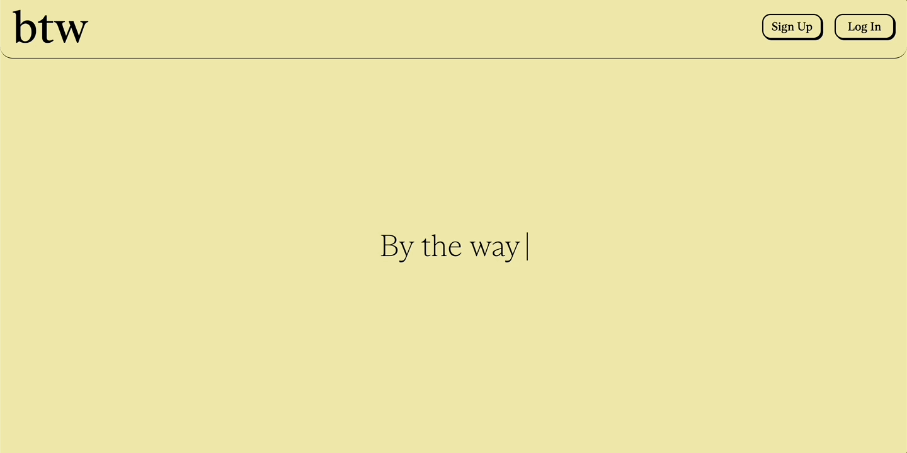

# btw

Live site: https://b-t-w.herokuapp.com

## Overview

btw is a social media app similar to early Facebook, with instantaneous global chat and private wall posts. 

### Register/Login
- Users can register and log in. User accounts are linked to unique e-mail addresses.
- Password reset with `crypto-random-string` and AWS SES.

### Profile
- Users can upload a profile image. Uploaded images stored with AWS S3.
- Users can set a 140 character bio and add one link to the Bio component. Link is represented as an icon for other users. Popular social media sites (Instagram, TikTok, twitter, Facebook) are represented with the appropriate site icon, while others are represented with a generic.
- A Wall component takes up the majority of the space in a user's profile. Users can create new Wall posts using the button on the bottom-right of the page. The writing component utilizes `Quill.js`, allowing users to compose posts through an elegant rich-text editor.
- Wall posts stored in state using `Redux`.

### Friends
- Search for other users within the Friends component. Search loops through the global database of users and instantly returns the top 5 entries matching query.
- The Friends component also includes existing lists of Friends and Requests, stored in state using `Redux`.

### Global Chat
- A Global Chat component is embedded on the profile page. The chat is populated on load via `Redux` and new chat messages are instantly served using `Socket.IO`.
- Each chat message includes the sender's profile picture and name. The profile pic links to their profile page.

### Other Users Profiles
- Users profile picture, name, bio, and link are publicly available to all.
- A button in the Bio component allows users to Add Friend, Unfriend, or Cancel Request. This behavior is handled via `Redux` and reflected in the Friends page.
- Other users Wall components are private unless Friends. 

## Tech Stack

JavaScript, React, Redux, Socket.IO, Quill.js, node.js, Express, PostgreSQL, Heroku, AWS